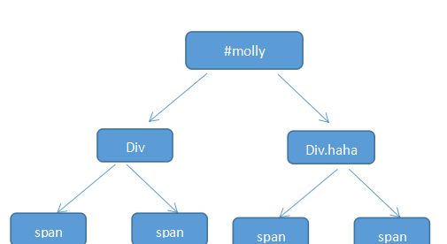

# 2020-05-09
# [html] 浏览器是如何解析html的？ #

## 1.浏览器如何解析HTML ##

	渲染引擎的基本工作流程
	1.解析HTML构建DOM树
	2.渲染树的构建
	3.渲染树的布局
	4.绘制渲染树

	渲染引擎会解析HTML文档，并把标签转换成内容树中的DOM节点，会解析style元素和外部文件的样式数据。
	样式数据和HTML中的显示控制将共同创建--渲染树renderObject。
	渲染引擎会在处理后续内容的同时把处理过的局部内容先展示出来，而不是等到所有HTML都被解析完才创建并渲染树。
	
	不同的浏览器由于内核不同，整个渲染流程大同小异。

	* 开始解析
	解析器通常把工作分给两个组件——分词程序负责把输入切分成合法符号序列，解析程序负责按照句法规则分析文档结构和构建句法树。
	词法分析器知道如何过滤像空格，换行之类的无关字符。
	解析分为两个部分：分词与构建树。它把输入解析成符号序列。
	在HTML中的开始标签、结束标签、属性名称和属性值。分词器识别这些符号并将其送入树构建者，然后继续分析处理下一个符号，直到输入结束。	

## 2.浏览器如何解析css ##

	css的选择器都是全局的，好处是代码重用率高、可以把css文件合并、拆分；坏处是css写法特别灵活，容易形成紧耦合。
	
	实际上css选择器的读取顺序是从右向左。例如：
	#molly div.haha span{color:#f00} //描述的是molly中的div.haha的span标签，层层嵌套。
	浏览器从右向左读取选择器，先找到span然后顺着往上找到class为haha的div，然后再找到id为molly的div的元素。
	成功匹配则加入结果集，如果直到根元素html都没有匹配，则不会再遍历这条路径，从下一个span开始重复这个过程。
	整个过程会形成一条符合规则的索引树，树由上至下的规则中从右向左的一个个选择匹配的节点。

	

	如果从左向右的顺序读取，在执行到左边的分支后发现没有相对应标签匹配，则会回溯到上一个节点再继续遍历，直到找到或者没有相匹配的标签才结束。
	如果有100个甚至1000个分支的时候会消耗很多性能。
	反之从右向左查找极大的缩小的查找范围从而提高了性能。这就解释了为什么id选择器大于类选择器，类选择器大于元素选择器。

## 3.浏览器如何解析js ##

	浏览器中有一个 js解析器 的工具来解析js代码。我们关注其中的2个步骤：
	1.js预解析
	解析器会找到js中的所有变量、函数、参数，进行函数提升(优先)和变量提升，
	并把var声明的变量赋值为未定义undefined，将函数取出来称为一个函数块，然后放到仓库当中。
	2.逐行解析代码
	由上向下，由左向右，然后去和仓库进行匹配。
	
	
	作用域：能够进行读写操作的一个区域。
	
	稍加修改后。。。。。。
	
	继续修改。。。。。。
	

# [css] 使用css写一个红绿灯交替的动画效果 #

	主要借助与：@keyframes标签 创建动画从一个css样式设定到另一个样式，指定动画进程百分比，每个百分比会自己形成一个变化的阶段，阶段完成会有短暂停留。
	
	<body>
	    

	        

	    

	</body>
	.traffic-light::after { 
	/* 简介写法： 绑定动作名称；动画时间5s；速度曲线linear；延时0s；播放次数infinite；是否下一次动作逆向，默认normal，逆向可设置为alternate */
        animation: traffic-light 5s linear 0s infinite; // 必须定义的animation
		-webkit-animation: traffic-light 5s linear 0s infinite; /* Safari and Chrome */
    }
    @keyframes traffic-light,
	@-webkit-keyframes traffic-light /* Safari and Chrome */	
	 {
        from {
            background: transparent; /* 黄灯 */
            box-shadow:
                -85px 0 0 0 transparent,/* 红灯 */
                85px 0 0 0 transparent,/* 绿灯 */
                -85px 0 15px 0 transparent,/* 红灯光影 */
                0px 0 15px 0 transparent,/* 黄灯光影 */
                85px 0 15px 0 transparent; /* 绿灯光影 */
        } 

        50% {
            background: rgb(231, 183, 78); /* 黄灯 */
            box-shadow:
                -85px 0 0 0 transparent,/* 红灯 */
                85px 0 0 0 transparent, /* 绿灯 */
                -85px 0 15px 0 transparent, /* 红灯光影 */
                0px 0 15px 0 rgb(231, 183, 78), /* 黄灯光影 */
                85px 0 15px 0 transparent;/* 绿灯光影 */
        } 

        to {
            background: transparent; /* 黄灯 */
            box-shadow:
                -85px 0 0 0 transparent,/* 红灯 */
                85px 0 0 0 transparent,/* 绿灯 */
                -85px 0 15px 0 transparent,/* 红灯光影 */
                0px 0 15px 0 transparent,/* 黄灯光影 */
                85px 0 15px 0 transparent;/* 绿灯光影 */
        }
    }
		

 

# [js] 写一个获取非行间样式的方法 #

	行间样式：行间样式就是写在标签体内的样式：如，

，在这里color样式就是行间样式。
	非行间样式：非行间样式就是指不是写在标签体内的style属性的样式。如内的定义的样式或引用的外部css文件都是非行间样式。
	
	1.非行间样式的获取 存在兼容问题，非IE浏览器和IE8及以下
	//非IE获取方式
 	window.getComputedStyle(atrr).ele;// atrr为目标元素；ele为要获取的样式
	//IE8及以下获取方式
	(attr).currentStyle.ele;

	如何使用：
	if(getComputedStyle){
   		 window.getComputedStyle(attr).ele
	}else{
	    (attr).currenStyle.ele
	}
	//写成一行==========================
	window.getComputedStyle ?window.getComputedStyle(attr).ele:(attr).currenStyle.ele;
	
	2.行间样式的获取
	attr.style.ele;//例如： document.getElementById("myDiv").style.color;
	window.innerHeight; //浏览器高度
	window.innerWidht; //浏览器宽度
		
# [软技能] 你认为企业内部协同工具最重要的功能是什么？ #

	对于任何OA软件来说，能不能发挥作用，并不是取决于软件本身，而是取决于如何使用。
	协同工具主要帮助我们解决的问题基本：
	1.提升工作效率
	2.规范业务操作
	3.挖掘业务价值
	但是，这三者之间是相互矛盾的，引入协同工具时应该注重平衡性。