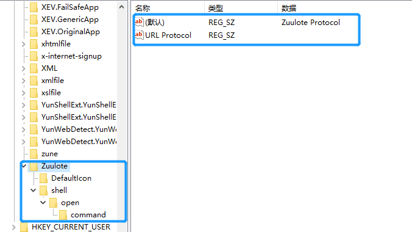
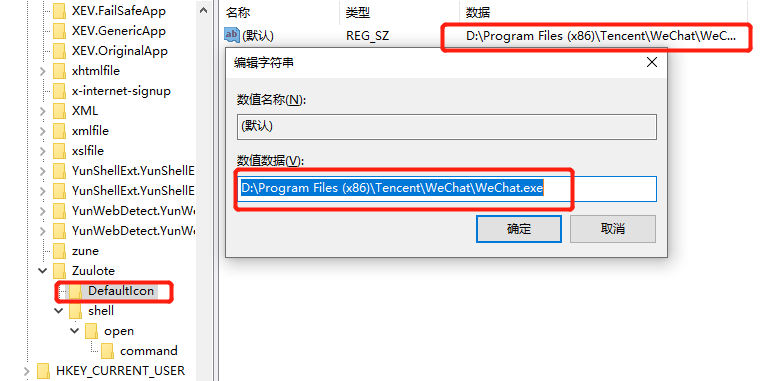
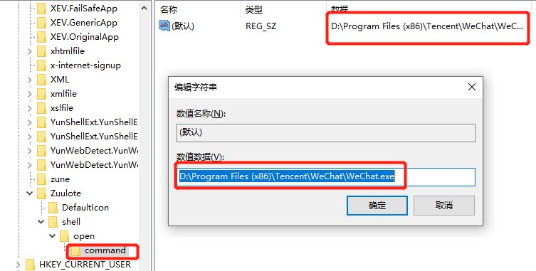

# 2020-05-11
# [html] html如何启动本地的exe应用？ #
	自定义URL Protocol协议，使一些应用软件可以在浏览器中点击一个URL后自动启动，并执行操作。
	1.新建注册表项，注册url protocol
	

----------

----------

	2.HTML中新建a标签 `<a href="Zuulote://" >open the WeChart</a>`
	
	3.浏览器访问HTML，点击超链接即可打开微信应用。

# [css] 使用css画个镰刀形的月亮 #
	1.绘制 Moon 主要是box-shadow属性的应用
	#moon {
        width: 80px;
        height: 80px; 
        rotate: 90deg;
        border-radius: 50%;
		/* 水平阴影位置 垂直阴影位置 模糊距离 阴影大小 color */
        box-shadow: 13px 2px 0 0 red;
    }
 	2.CSS绘制常见的形状和图形
	https://www.cnblogs.com/Mr-liyang/p/6673854.html

	https://www.cnblogs.com/liangxiaofeng/p/5936760.html

# [js] localStorage什么时候过期？ #

	 localStorage的生命周期是永久的，除非用户在浏览器UI界面清除信息。
		
# [软技能] 你会沉迷于玩手机吗？对于微信的使用你是怎么看待的？ #

 	首先，微信是一款社交软件，从聊天、信息记录、开会到个人金融等各方面的功能已经深入生活的每个角落。
	微信的使用还是要正确对待的，可以开通订阅号，记录每次的心得体会，形成时间轴的心灵变化历程，或者与志同道合的朋友交流经验，分享感悟。