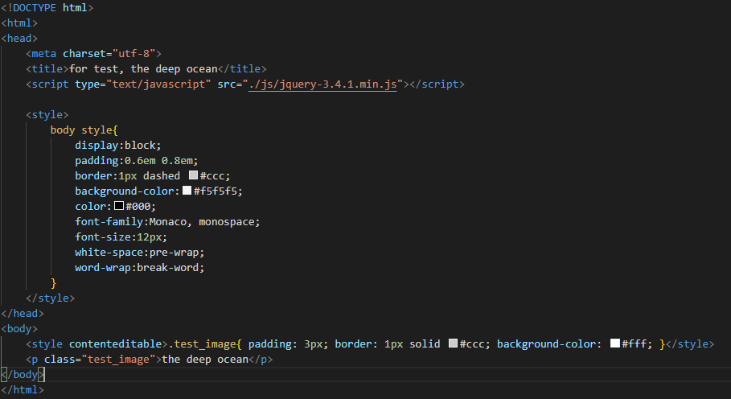
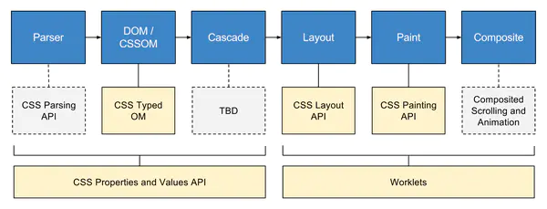

# 2020-05-12
# [html] 如何实现前端代码实时预览效果？

	前端页面的实时预览效果，可以为body或style标签设置属性 contenteditable;另一种方式是设置document.designModle = "on";
	例如： 
	

# [css] 你了解CSS Houdini吗？说说它的运用场景有哪些？ #
	浏览器在渲染页面时，首先会解析页面的 HTML 和 CSS，生成渲染树（rendering tree），再经由布局（layout）和绘制（painting），呈现出整个页面内容。	

	Houdini是一组底层API，它们公开了CSS引擎的各个部分，从而使开发人员能够通过加入浏览器渲染引擎的样式和布局过程来扩展CSS。
	说白了：Houdini是一组API，它们使开发人员可以直接访问CSS 对象模型 （CSSOM），
	使开发人员可以编写浏览器可以解析为CSS的代码，从而创建新的CSS功能，而无需等待它们在浏览器中本地实现。

	主要的API:
	CSS Properties and Values API 允许CSS中定义变量和使用变量；
	Layout API 允许开发者编写自己的 Layout Module，自定义诸如 display 这类的布局属性；
	Painting API 允许开发者编写自己的 Paint Module，自定义诸如 background-image 这类的绘制属性。

# [js] 如何判断两个对象相等？ #
	1.通过JSON.stringify(obj)转化成json字符串进行判断；

	优点：简单快速，对于顺序相同的对象适用； 缺点：对象内key的顺序不同会造成错误；

	2.通过getOwnPropertyNames()进行比较 Object.getOwnPropertyNames(obj);	

	// 对Object扩展一个方法chargeObjectEqual
	Object.prototype.chargeObjectEqual = function(obj){
	    // 当前Object对象,this指向
	    var propsCurr = Object.getOwnPropertyNames(this);
	    // 要比较的另外一个Object对象
	    var propsCompare = Object.getOwnPropertyNames(obj);
	    if (propsCurr.length != propsCompare.length) {
	        return false;
	    }
	    for (var i = 0, i < propsCurr.length; i++) {
	        var propName = propsCurr[i];
	        if (this[propName] !== obj[propName]) {
	            return false;
	        }
	    }
	    return true;
	}

	优点：消除了key的顺序影响； 缺点：不适用于多层的对象比较；

	3.深度比较 --葵花宝典已记录
	
		
# [软技能] 远程修复bug #

 	重要程度，协同工具，上传bug，远程修改。