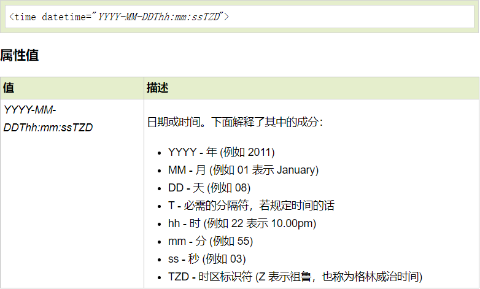
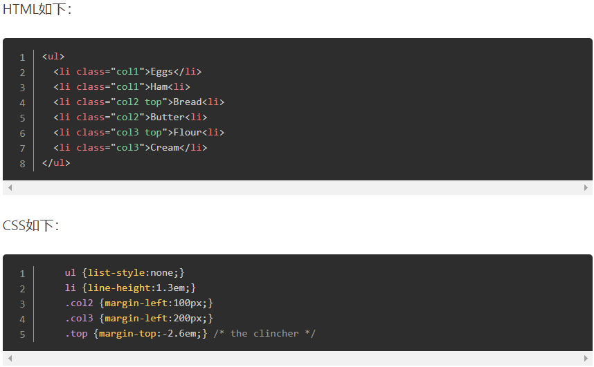

# 2020-05-13

# [html] 你有使用过time标签吗？说说它的用途有哪些？ #

	time标签是H5的新属性，<time> 标签定义公历的时间（24 小时制）或日期，时间和时区偏移是可选的。该元素能够以机器可读的方式对日期和时间进行编码。

	<time>9:00</time>
	<time datetime="2020-02-14">情人节</time> 
	
	其中的datetime属性是日期或时间

	
	<time datetime="2014-09-16T18:20:30">Tuesday at 18:20</time>
	<time>2014-09-16T18:20:30+01:00</time> //带有时区的
	<time>2014-W18</time>  表示2014年第18个星期
	<time datetime="P4DT4H3M">four days</time> //表示一个时间段 4天4小时3分钟

# [css] css的负边距有哪些应用场景？ # 

	负边距不会令节点脱离当前文档流，能够影响后面节点的布局。
	应用：：气泡文字； 文本叠加等，再也不需要使用死板的绝对定位。
	例如：单列表改成多列表混排,margin-top设为负值的操作会使文档流上移

# [js] 举例说明js中什么是尾调用优化？ # 
	
	这里的优化指的是 空间上的优化 对解释器的改进，尾调用优化是在支持ES6的解释器中添加的。
	从定义上来看，尾调用就是函数里的最后一个动作是函数调用。只在严格模式下生效，目前主流浏览器只有safari支持尾递归调用。
	应用后可以降低空间复杂度。
	例如：
	function c() {
	   throw new Error()
	   return 'return from c'
	}
	function b() {
	   const b = 'b'
	   return c()
	}
	function a() {
	   const a = 'a'
	   return b(a)
	}
	a();
	由于尾调用，a的返回仅仅依赖b的调用。所以a的stack frame是没有必要保存的，这样空间复杂度从O(n)降到了O(1).
	
		
# [软技能] 你们平时怎么学习的效率最高？ # 
	
	1.相关文档 与其反复阅读，不如经常回顾
	2.多做练习，从错误中学习
	3.注意代码风格，多写可复用的代码
	4.劳逸结合，多与人讨论交流