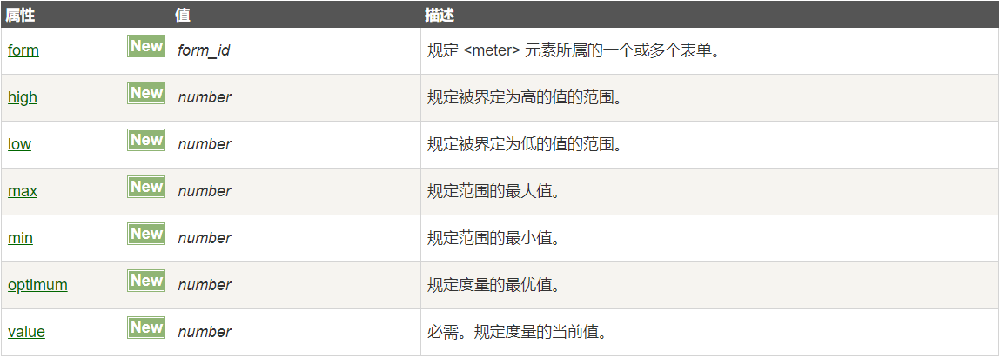

# 2020-05-15

# [html] 你有使用过meter标签吗？说说它的用途有哪些？ #
 	
	<meter>是H5的新属性，定义为度量衡，仅用于已知最大值和最小值的度量，比如磁盘的使用情况，查询结果的相关性等。注意：不能作为进度条使用。
	

	
展示给定的数据范围：

	<meter value="2" min="0" max="10">2 out of 10</meter> 
	<meter value="0.2">60%</meter>
	// 不同的参数设置可以呈现出不同颜色的划分
	<meter value="3" min="0" max="10" optimum="3" low = "4" high="8">value</meter>

	<pre> 标签可定义预格式化的文本。
	被包围在 <pre> 标签 元素中的文本通常会保留空格和换行符。而文本也会呈现为等宽字体。

# [css] 你用过css的tab-size属性吗？浏览器默认显示tab为几个空格？
	
	tab-size属性规定制表符(tab)的空格长度，浏览器默认的tab显示是4个空格。
	目前只有 Chrome 支持 tab-size 属性。
	Firefox 支持另一个可替代该属性的属性，即 -moz-tab-size 属性。
	Opera 支持另一个可替代该属性的属性，即 -o-tab-size 属性。
 
	pre {tab-size: 16; } /* 针对 chrome 的代码 */
	pre {-moz-tab-size: 16; } /* 针对 Firefox 的代码 */
	pre {-o-tab-size: 16; } /* 针对 Opera 的代码 */

	document.getElementById("t1").style.tabSize = "16";
	document.getElementById("t1").style.MozTabSize = "16"; // 针对 Firefox 的代码
	document.getElementById("t1").style.OTabSize = "16"; // 针对 Opera 的代码

# [js] 字符串拼接方式有哪些？那种性能好？
	
	1.使用连接符“+”，只连接100个以下的字符串较为方便；
	var a = "java";
	var b = a + "script";
	
	2.使用数组的join方法,资源消耗更小，速度更快
	var arr = ["java", "script"]; //可以把需要连接的字符串push进数组中
	var str = arr.join(""); //连接时不会有 “ , ” "javascript"
	var str = arr.join(); // "java,script"
		
	3.concat()方法,该方法的参数类型和个数没有限制
	var a = "java"; 
	var b = "script";
	var str = a.concat(b);

# [软技能] 什么是单点登录？单点登录的流程有哪些?  

	单点登录英文全称Single Sign On，简称就是SSO。
	它的解释是：在多个应用系统中，只需要登录一次，就可以访问其他相互信任的应用系统。

	CAS(针对web应用的单点登录框架)官网上的标准流程:
	1.用户访问app系统，app系统是需要登录的，但用户现在没有登录。

	2.跳转到CAS server，即SSO登录系统，以后图中的CAS Server我们统一叫做SSO系统。 SSO系统也没有登录，弹出用户登录页。

	3.用户填写用户名、密码，SSO系统进行认证后，将登录状态写入SSO的session，浏览器（Browser）中写入SSO域下的Cookie。

	4.SSO系统登录完成后会生成一个ST（Service Ticket），然后跳转到app系统，同时将ST作为参数传递给app系统。

	5.app系统拿到ST后，从后台向SSO发送请求，验证ST是否有效。

	6.验证通过后，app系统将登录状态写入session并设置app域下的Cookie。

	至此，跨域单点登录就完成了。以后我们再访问app系统时，app就是登录的。