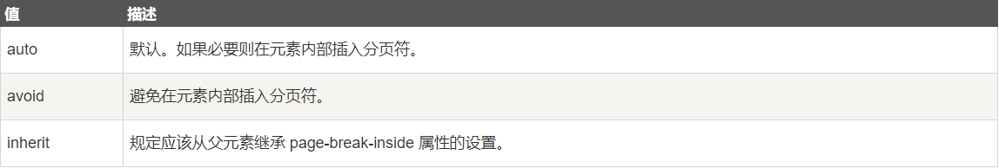
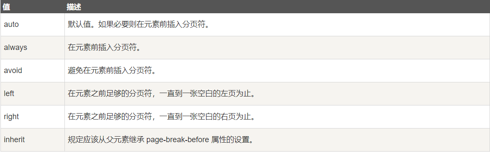
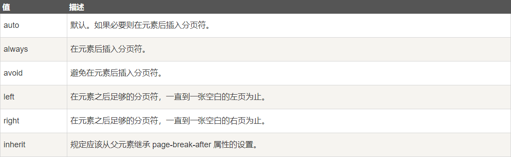

# 2020-05-17

# [html] 如何使用纯html制作一个进度条？
	思路：嵌套div等高不同宽，2个div的不同背景色及不同宽度来区别进度；
	
	

        
90%

    

	 
	#back{
        width: 300px;
        height: 30px;
        background-color: gray;
        border-radius: 10%;
        text-align: center;
    }
    #force{
        width: 270px; //占back宽度的90%
        height: 30px;
        background-color: red; //进度条为红色
		//background:repeating-linear-gradient(-45deg,red 0px,red 10px,blue 10px,blue 20px); //花式进度条	
        border-radius: 20px;
        color: #fff;
        line-height: 30px;
    }

# [css] 举例说明与打印有关的属性有哪些？
	注意：不能在绝对定位的元素使用；尽少使用分页属性，避免在表格、浮动元素、带border的块元素中使用分页属性。

	1.CSS3中新增了属性page, 属性值为auto：参照当前的默认页面；
		
	2.page-break-inside 属性，设置是否在指定元素中插入分页符；
	@media print { pre, blockquote {page-break-inside: avoid;} } //设置在pre 和blockquote 标签中避免使用分页符

	3.page-break-before 属性，指定元素前是否插入分页符；
	@media print { h1 {page-break-before: always;} } //h1标签前始终插入分页符
	

	
	4.page-break-after 属性，指定元素后是否插入分页符；
	@media print { footer {page-break-after: always;} }//footer标签后始终插入分页符

# [js] 在不支持js的浏览器中如何隐藏JavaScript代码？
	 
	 1.可以设置浏览器的 javascript.enabled

	 2.添加注释

# [软技能] 二维码会不会重复？如果重复怎么办？
	 
	二维码不会重复，因为不同内容生成的二维码团使不一样的。一般都会有个对应值，可以是网址或编号，对应值不同二维码就不同。
	
	即使是重复还有其他的限制因素，比如说：
	1.接口	微信的二维码支付宝就识别不了，因为接口不同；
	2.时效性	添加时间的约束，像是昨天的二维码今天并不能使用；
	3.每次使用前添加认证流程。