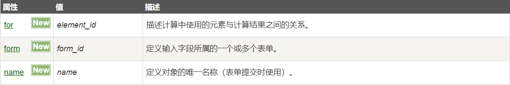

# 2020-05-18

# [html] 你有使用过output标签吗？说说它的用途有哪些？
	
	<output> H5的新标签，作为计算结果输出显示(比如执行脚本的输出)。

	<form oninput="x.value=parseInt(a.value)+parseInt(b.value)">
		0<input type="range" id="a" value="50">100
		+<input type="number" id="b" value="50">
		=<output name="x" for="a b"></output>
	</form>

# [css] 请写出font属性的快捷写法
	
	可以综合定义5中以上的font属性，用一行font属性来描述。
	书写顺序：font-style font-variant font-weight font-size font-family

	1.font-style 字体样式； normal 正常； italic 斜体； oblique 倾斜；
	2.font-variant 字母字体，small-caps: 所有小写变大写，称为小型大写，但是会比普通文本的字号小一些；

	.paragraph{ font: italic small-caps bold 14px arial; }
 

# [js] alert如何让文本换行？
	 
	使用转义字符 \n 或  \r\n ;		
	alert("java\nscript"); //chrome
	alert("java\r\nscript"); //ie chrome

# [软技能] 为什么会有ipv6的出现？它的出现将会带动哪些产业的发展 
	
	由于IPv4最大的问题在于网络地址资源有限，严重制约了互联网的应用和发展。
	IPv6的使用，不仅能解决网络地址资源数量的问题，而且也解决了多种接入设备连入互联网的障碍，而且会更加安全。

	将有力支撑起人工智能、工业互联网、物联网、移动互联及5G等心技术的发展。