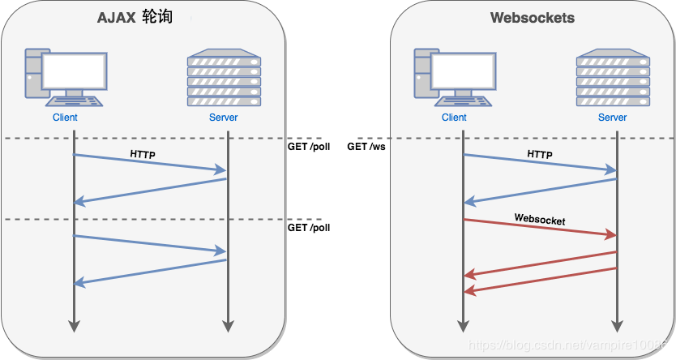

# 2020-05-20 题目来源：http://www.h-camel.com/index.html

# [html] DOM节点的根节点是不是body？
	
 	DOM节点的根节点是html，body的同级节点还有head。
	
	标准模式：浏览器按照W3C的标准执行
	怪异模式：浏览器按照自己的方式解析代码，为兼容旧版本浏览器

	主要区别在于对盒模型的解释不同：
	1、标准模式下：盒模型为标准模型，块的总宽度=width+margin（左右）+padding（左右）+border（左右）
	2、怪异模式下：盒模型为ie盒模型，块的总宽度=width+margin（左右）
	还有一些区别：垂直对齐方式、内联元素的尺寸、元素的百分比高度、元素的溢出处理等；

# [css] css中的url()要不要加引号，理解？
	
 	标准写法是要加上引号，例如：url("http://www.baidu.com"),这样就约束了括号内容为string,避免因为属性值中存在特殊字符造成浏览器解析错误。

# [js] 一个api接口从请求数据到请求结束与服务器进行了几次交互？
	 
 	API（Application Programming Interface，应用程序接口）是一些预先定义的函数，或指软件系统不同组成部分衔接的约定。
	
	如果已经建立了连接，那么单次请求数据到请求结束应该是一次交互；
	如果没有建立连接，根据协议不同可能会不同吧， 像ajax轮询和websocket与服务器建立连接后的数据流向就存在区别。

# [软技能] ...... 
	
 