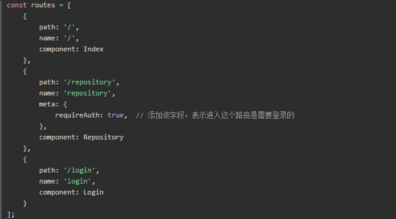
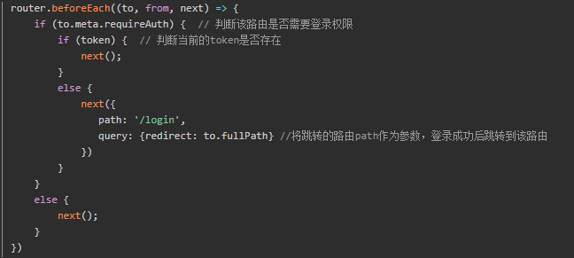
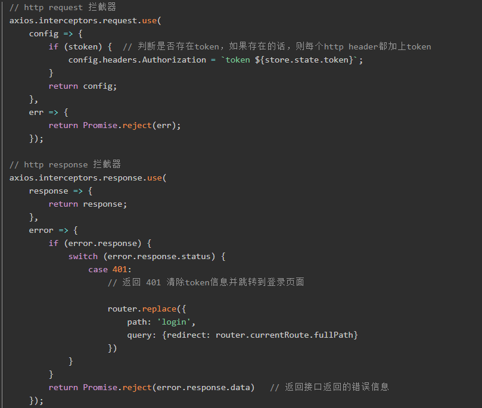

# 2020-05-25 题目来源：http://www.h-camel.com/index.html

# [html] 如何在网页中嵌入公司地址的地图？
	
	1.利用百度地图提供的API接口 http://api.map.baidu.com/lbsapi/creatmap/，进行属性设置，创建地图，保存代码map.html
	
	2.在需要引入地图的html中	<iframe src="map.html" width="716px"  height="553px"></iframe>

	3.css样式调整，美化

# [css] box-sizing的宽度包含了哪些？
	
	box-sizing是规定容器元素的最终尺寸计算方式，margin不会被计入最终容器的宽度计算。

	div的尺寸为 width:100px; border:10px solid red; padding:10px; 

	1.如果div的box-sizing: content-box; （默认）或者没有设置box-sizing属性

	div的实际宽度为：100px(width)+2*10px*(padding)+2*10px(border)=140px,得到尺寸更大的容器，会破坏网页布局。
	
	2.如果div的box-sizing: border-box; 那么div的最终宽度为100px; 它的内容部分的有效宽度被压缩，不会影响外部的整体布局。
	
	div的内部content的有效宽度：100px-2*10px-2*10px =60px;

# [js] axios拦截器原理是什么？
 	
	1.路由拦截 定义完路由，利用vue-router提供的钩子函数beforeEach()对路由进行判断。

	to.meta中是我们自定义的数据，其中就包括我们刚刚定义的requireAuth字段
	通过这个字段来判断该路由是否需要登录权限,需要的话，同时当前应用不存在token，则跳转到登录页面，进行登录。登录成功后跳转到目标路由。
	这种方式只是简单的前端路由控制，并不能阻止用户访问，假设有一种情况：当前token失效了，但是token依然保存在本地。
	这时候你去访问需要登录权限的路由时，实际上应该让用户重新登录。这时候就需要结合http拦截器 + 后端接口返回的http状态码来判断。

	2.拦截器 统一处理所有http的请求和响应，通过配置http response inteceptor，当后端返回401(未授权)，让用户重新登录。

	
 
# [软技能] 说说你对代码的可维护性的理解  
	
	可读性、直观性、可适应性、可拓展性、可调试性。