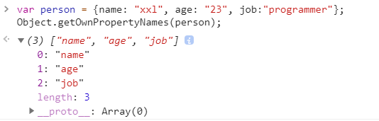

# 2020-05-29 题目来源：http://www.h-camel.com/index.html

# [html] pre与xmp标签有什么区别？
	
	1. <xmp>标签 在html5中已经弃用；<xmp> 标签之间的内容不会被当作文档内容解析，而会被用等宽字体直接呈现。
	
	2. <pre>标签 用于替代<xmp>来使用，<pre> 标签中的内容会保留 空格 和 换行符，而文本也会等宽呈现。
	标签中的特殊符号被转换为符号实体，比如 "&lt;" 代表 "<"，"&gt;" 代表 ">"。
	
	如果希望使用<pre>标签来定义计算机源代码，比如HTML源代码，请使用符号实体来表示特殊字符。
	一般将<pre>标签与<code>标签结合起来使用，以获得更加精确的语义，用于标记页面中需要呈现的源代码。
	

# [css] 如何让表格单元格等宽显示？
	
	.myTale { table-layout: fixed; } /* safari 6 好像会报错 */

# [js] 写一个方法遍历指定对象的所有属性
	
	Object.getOwnPropertyNames(obj);

	eg: var person = {name: "xxl", age: "23", job:"programmer"};
		Object.getOwnPropertyNames(person);

# [软技能] 127.0.0.1和localhost区别是什么？

	1. 127.0.0.1
	是保留地址之一，常用来检验本机TCP/IP协议栈而已，ping 127.0.0.1,可以ping通的话，就说明：本机的网卡和IP协议安装都没有问题,
	127.0.0.1是通过网卡传输，依赖网卡，并受到网络防火墙和网卡相关的限制。

	2. localhost是一个域名，可以被分配任何IP地址，习惯性设置为 127.0.0.1
	localhot(local)是不经网卡传输！这点很重要，它不受网络防火墙和网卡相关的的限制。

	3. 本机IP 
	本机IP与127.0.0.1的区别是： 127.0.0.1 只能通过本机访问，而本机IP通过本机访问也能通过外部访问