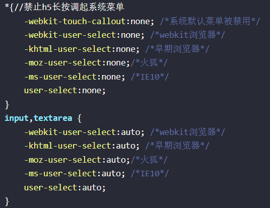

# 2020-05-30 题目来源：http://www.h-camel.com/index.html

# [html] 网页打印与标准纸张换算时，cm和px是如何换算的？
	
	在公制长度单位与屏幕分辨率进行换算时，必须用到一个DPI(Dot Per Inch 每英寸像素值)指标。网页打印中，默认采用的是96dpi，并非传闻的72dpi。
	A4纸张的尺寸是210×297mm，按1英寸=25.41mm换算，即8.264×11.688英寸。

	所以，A4纸96dpi下的分辨率是794×1123，这就是我们在制作网页的时候需要的像素。
 
	但是打印机是无法满幅打印的，总要有页边距，所以我们在制作网页的时候必须减去页边距。 

	例如大多网页的常用图片分辨率为72dpi,每英寸的像素为72px,按1英寸=25.41mm换算,可以得出：150*150mm的图片,像素长度是 420*420px.
	
# [css] H5如何禁止显示系统菜单？
	
 	用户长按时会出现系统的默认菜单，还要给input开放允许
	

# [js] js循环中调用异步的方法，如何确保执行结果的顺序是正确的？
	
	1. 回调函数 -- 同步变异步 f1不会阻塞程序运行 延迟执行耗时的程序逻辑
	优点：简单 易部署理解；	缺点：各部分紧耦合，不易阅读维护

	function f1(callback){
		setTimeout(function(){
			//f1的代码
			callback();
		},1000)
	}
	f1(f2);
	
	2. 事件监听 -- f1执行完触发done事件来执行f2
	优点：可以绑定多个事件，利于实现模块化，去耦合；		缺点：程序变成事件驱动，运行流程混乱

	f1.on("done".f2);
	function f1(){
		setTimeout(function(){
			//f1的代码量
			f1.trigger("done");
		},1000)
	}
 
	3. 发布订阅模式(观察者模式) f1执行完向jQuery发出done信号，从而f2执行开始
	jQuery的插件，可以查看 消息中心 监控程序的运行	

	jQuery.subscribe("done",f2);
	function f1(){
		setTimeout(function(){
			//f1的代码
			jQuery.publish("done");
		},1000)
	}
	
	4. promises对象 -- 每个异步任务返回一个promise对象，该对象的then()方法来指定回调函数
	f1().then(f2).then(f3);

	5. Generator
	6. async await

# [软技能] 举例说明恶意代码都有哪些？

 	1. 会造成死循环的  while(true)
 	
	

 	2. 递归调用

	

	3. 修改系统设置：ie浏览器主页、窗口标题；修改或禁用右键菜单；修改系统hosts文件；修改注册表；禁用注册表和任务管理器；