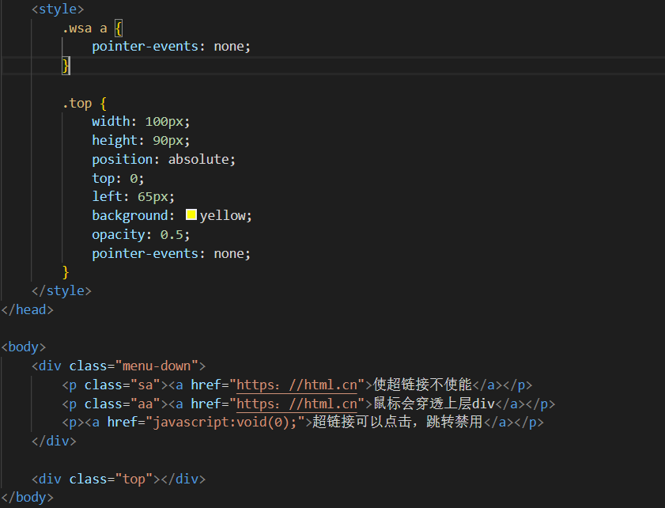

# 2020-06-02 题目来源：http://www.h-camel.com/index.html

# [html] html中如何使用svg？
 
	1. 使用 <embed> 标签： <embed src="circle1.svg" type="image/svg+xml" />
	
	2. 使用 <object> 标签： <object data="circle1.svg" type="image/svg+xml"></object>

	3. 使用 <iframe> 标签： <iframe src="circle1.svg"></iframe>

	4. 使用 <a> 标签： <a href="circle1.svg">View SVG file</a>

	5. 直接嵌入html 
	<svg xmlns="http://www.w3.org/2000/svg" version="1.1">
	   <circle cx="100" cy="50" r="40" stroke="black" stroke-width="2" fill="red" />
	</svg>

# [css] 如何阻止:hover、:active等鼠标行为状态的触发？
 
	pointer-events 属性
	应用：
	1. 提交页面，点击按钮后添加 style = "pointer-events",防止重复提交。
	
	2. 使连接不能点击 

	3. 让鼠标点击穿透上层div
 

# [js] 代码中如果遇到未定义的变量，会抛出异常吗？程序会继续执行吗？ 
 
	代码遇到未定义的变量，会抛出ReferenceError，由于js是单线程，所以程序不会继续执行。

# [软技能] 说说你对UML的理解 
	统一建模语言(Unified Modeling Language，UML)是一种为面向对象系统的产品进行说明、可视化和编制文档的一种标准语言。

	https://blog.csdn.net/soft_zzti/article/details/79811923
	https://www.zhihu.com/question/23569835