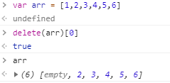

# 2020-06-03 题目来源：http://www.h-camel.com/index.html

# [html] 你有使用过webp的图片格式吗？
	webp是一种新兴的图片格式，优势体现在它具有更优的图像数据压缩算法，能带来更小的图片体积，而且拥有肉眼识别无差异的图像质量；
	同时具备了无损和有损的压缩模式、Alpha 透明以及动画的特性，在 JPEG 和 PNG 上的转化效果都非常优秀、稳定和统一。
	webp的优点：
	1. 同等质量但是图片更小
	2. 压缩后质量无明显变化
	3. 完美支持无损图像
 
	webp的缺点：
	1. 相比于jpg 编码速度慢10倍，解码速度慢1.5倍，但是由于文件体积的减少，加载速度会变快，渲染速度也变快了。
	2. 支持性上面，目前桌面浏览器chrome和opera浏览器，手机支持原生android和android系统上的chrome浏览器。
	3. 目前不被任何操作系统原生支持。
	
	webp应用：
	1. 浏览器场景
	javascript能力检测，对支持webp的用户输出webp图片
	使用webp支持插件
	2. app场景
	3. 后台场景(Webp的转换)

# [css] 假如css的分号写在声明块之外，将会发生什么呢？解释下原因
  	
	
	
	
红色字体

	
绿色字体

	现象是： 紧跟着 ; 的第一个声明块的样式不会生效，第二个及第二个以后的声明块的样式正常。

# [js] 使用delete删除数组，其长度会改变吗？
 
	delete(array)[index]--删除后数组的长度不会改变

		

# [软技能] 如果给你接手团队的管理，团队内部的流程很乱你该怎么办？
	 引入合适的协同办公软件，建立奖励机制，提高员工积极性