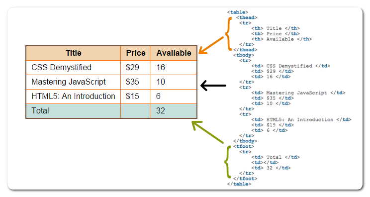
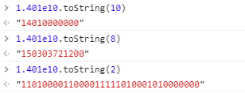
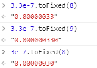

# 2020-06-06 题目来源：http://www.h-camel.com/index.html

# [html] 如何让table的边框双线变单线？

	border-spacing 属性设置相邻单元格的边框间的距离（仅用于"边框分离"模式）。
	
	border-spacing: 0; /* 双线变为单线 */

	table{border-collapse:collapse;border-spacing:0;border-left:1px solid #888;border-top:1px solid #888;}  
	
	th,td{border-right:1px solid #888;border-bottom:1px solid #888;padding:5px 15px;}  
	
	th{font-weight:bold;} 
	

# [css] 使用css实现蒙版的效果
 
	常见的有2种，一个是图形蒙版，一个是文字蒙版。 样例请参考：：https://www.jianshu.com/p/a538940521b1
	
	1. 图形蒙版： clip-path--根据指定的图形轮廓来保留剩余的区域，例如 你指定的图形是心形，那么最后保留的就是心形。
	   一种实现是保留剪切图形轮廓内的部分，shpape-masking
		另一种是保留剪切图形之外的部分，reverse clip path
	2. 文字蒙版：主要依赖于background-clip属性
	   background-clip: border-box; /* 默认值，背景绘制在边框方框内，剪切成边框方框 */
	   background-clip: padding-box; /* 剪切成衬距方框 */
	   background-clip: content-box; /* 剪切成内容方框 */

# [js] 写一个方法把科学计数法转换成数字或者字符串
 	
 	我看的是这篇文章：： https://www.cnblogs.com/xianfengzhike/p/9939029.html
	
	1. 一般情况下，可以使用toString()方法

	
	但是当我们遇到 小于1，小数点后面带有6个以上0 的浮点数值，toString()就不行了。 3.3e-7.toString(10) //"3.3e-7"
	
	2. 为了解决 小于1，小数点后面带有6个以上0 的浮点数值 利用Number.toFix(digtis)，digtis代表小数点后保留的数字位数；
	   一般情况，我们需要 小数的位数固定，所以 .toFix()基本满足需求。
	

	3. 上面的需要改进，因为最后的0没有什么意义，比较多余，借助于正则表达式
	function toNonExponential(num) {
        var m = num.toExponential().match(/\d(?:\.(\d*))?e([+-]\d+)/);
        return num.toFixed(Math.max(0, (m[1] || '').length - m[2]));
    }
    toNonExponential(3.3e-7) // "0.00000033"
    toNonExponential(3e-7) // "0.0000003"
    toNonExponential(1.401e10) // "14010000000"
    toNonExponential(0.0004) // "0.0004"

	用.toExponential()将数字转化为科学记数法表示，匹配正则表达式/\d(?:\.(\d*))?e([+-]\d+)/,
	获取科学记数法中小数点后的字符及幂指数（e 后面的值），这样可以确定数字是几位小数。再用toFixed() 转换成数值表示。

# [软技能]  组织架构

	。。。。。。
	