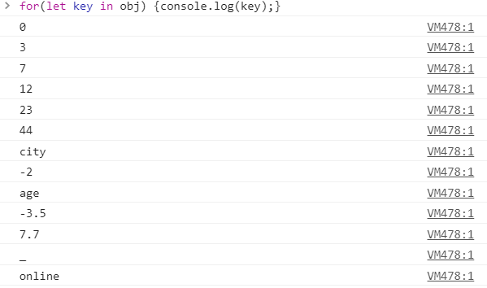
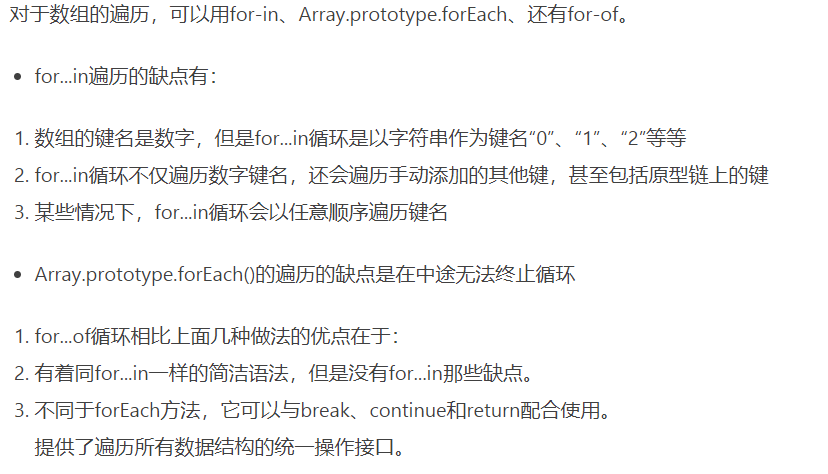

# 2020-06-10 题目来源：http://www.h-camel.com/index.html #

# [html] Media Source Extensions(MSE)的理解，它解决了什么问题呢？ #
	这里说的非常详细，https://www.jianshu.com/p/1bfe4470349b

	使用 <vedio> 标签，支持html5的浏览器实现无插件就可以支持播放媒体内容，但是对媒体格式有所限制，例如MP4、WEBM、OGG;
	视频文件通过编码来压缩文件大小，再通过封装将压缩音频、字幕组合到一个容器，那么就存在封装格式和编码格式。
	
	FLV 格式非常简洁，而 MP4 内部 box 种类繁杂，结构复杂固实而又有太多冗余数据。
	FLV 天生具备流式特征适合网络流传输，而 MP4 这种使用最广泛的存储格式，设计却并不一定优雅。

	目前的视频都是通过流媒体传输协议从服务端分发给客户端，媒体内容进一步被包含在一层传输协议中，那么 <vedio> 就无法识别了，
	以Apple的HLS为例，源文件内容被分散的封装在一个个的TS文件中。
	仅靠 <vedio> 无法识别这样的TS文件，就引入了MSE扩展来帮助浏览器识别处理TS文件，将其变为可识别的媒体容器格式，
	这样 <vedio> 就可以识别和播放了，支持H5的浏览器就相当于内置一个能够解析流协议的播放器。 

# [css] 使用css实现太阳自转同时地球围着太阳公转的效果 #
	一般使用animation，结合clip-path(按照一定规则去切割图形)做出特别的动画
	clip-path: circle(40%);  // 圆形
    clip-path: ellipse(130px 140px at 10% 20%); // 椭圆 
    clip-path: polygon(50% 0, 100% 50%, 50% 100%, 0 50%); //多边形

	https://www.cnblogs.com/yincheng/p/css3-animation.html 这里需要仔细计算位置坐标
 
# [js] 使用for-in语句能保证遍历对象的顺序吗？ #
	这里抄个例子来，可以说各种类型都有了，想要知道obj的长度，当然不能obj.length；获取对象和属性可以使用for-in
	var obj={city: "Beijing", 7:7,  0: 0, "-2": -2, "age": 15, "-3.5": -3.5, 7.7: 7.7, _: "___", online: true, 3: 3, "23": "23", "44": 44}
	
	for(let key in obj) { console.log(key); }

	for(let key in obj) { console.log(obj[key]); }

	根据 ECMA-262（ECMAScript）第三版中描述，for-in 语句的属性遍历的顺序是由对象定义时属性的书写顺序决定的。

	根据 ECMA-262（ECMAScript）第五版规范中，对 for-in 语句的遍历机制又做了调整，属性遍历的顺序是没有被规定的。

	但是，ES6中提出了 for of，作为遍历所有数据结构的统一方法，可但是，数据结构需要部署iterator接口才可以使用for of，
	普通对象for of 会报错，for in可以遍历键名
	for of循环可以使用的范围包括数组、Set 和 Map 结构、某些类似数组的对象（比如arguments对象、DOM NodeList 对象）、后文的 Generator 对象，以及字符串
	

# [软技能] 登录时的验证码是纯数字的话，你觉得用4位数好还是6位数好？ #
	如果仅用于登录验证，4位就可以满足需求，可以设置有效时间；这样期限加上4位随机数也具有一定的安全性了，而且，用户使用方便；
	在支付环节等敏感关键节点，建议采用6位数的验证码，这样更加安全；
	6位数的密码较4位数的密码，成本也更高些。