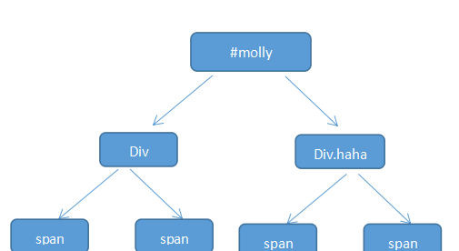

# 2020-06-12 题目来源：http://www.h-camel.com/index.html #

# [html] 你有使用过HTML5 Boilerplate吗？说说你对它的理解 #
	为web前端的最佳实践的HTML+CSS+jquery模板集合，引用知乎的评价：
	1. Viewport Metatag：让页面能够在各种设备上正确显示。
	2. Chrome Frame：对于某些老浏览器，比如：IE6,7,8,不支持的新特性，H5BP可以让你的代码能够向下兼容（我会建议用户换浏览器，浏览器又不收费）。
	3. Crossdomain.xml：用于支持跨域请求。Web Server Configuration Files：用于优化服务器。这是给系统管理员用的。严格来讲，这不属于前后端开发。

	如果需要使用前端开发框架，首选Bootstrap或Foundation,如果你的APP还需要上述功能，则H5BP可以当插件用。

# [css] 为什么说css的选择器一般不要超过三级？ #
	遇到这个问题，说实话，之前并没有使用超过3级的css选择器，也没有考虑过影响。
	首先要明确的是，CSS的解析过程，在解析选择器的时候，是从右向左，从上到下及逆行解析的。
	#molly div.haha span{color:#f00}
>浏览器从右向左读取选择器，先找到span然后顺着往上找到class为haha的div，然后再找到id为molly的div的元素。

>成功匹配则加入结果集，如果直到根元素html都没有匹配，则不会再遍历这条路径，从下一个span开始重复这个过程。

>整个过程会形成一条符合规则的索引树，树由上至下的规则中从右向左的一个个选择匹配的节点。

 	
>从树形结构来看，超过3级的话，复杂度很提高很多，从而影响解析效率。(个人猜测，并没有实际测试)

# [js] 为什么要用纯函数？  #
	什么是纯函数？定义：
	1. 函数的调用参数相同，永远返回相同的结果。不依赖程序执行期间函数外部任何状态或数据的变化，仅依赖于函数入参。
	2. 函数不会产生任何可观察的副作用，例如网络请求，输入输出设备或数据突变。

	举例说明：
	1. 纯函数
		function pure(price) { return (price*10 + price)} // 返回结果仅依赖于入参price
	2. 非纯函数
		var tax = 10;
		function impure(price) { return (price*tax + price) } // 返回结果还受到外部全局变量tax的影响

	什么是副作用？
	一个可以被观察的副作用，函数内部与外部的任意交互，可能是函数内修改外部变量，或者在函数内调用另外一个函数等。
	如果纯函数调用纯函数，如果不产生副作用，那么它还是纯函数。
	副作用来自，不限于：
    * HTTP请求
    * 输出数据到console或屏幕
    * DOM查询/操作
    * Math.random()
    * 获取当前时间
    * Mutating data 变异数据
	
	纯函数的重要意义：
	1. 函数式编程中应用广泛，ReactJS Redux等优质的库需要使用纯函数
	2. 测试及重构
		纯函数利用代码维护和代码重构，你可以放心的对一个纯函数进行重构，不会担心这样做对其他函数的影响，从而减少副作用的产生。

# [软技能] 你是怎么平衡及处理工作，学习，生活三者的关系？ #
	相互交织，相爱相杀，
	