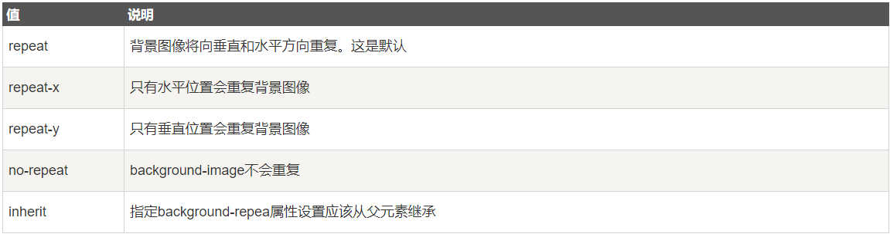
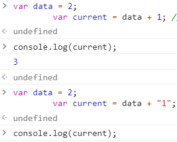

# 2020-06-16 题目来源：http://www.h-camel.com/index.html #

# [html] http和websocket能共用一个端口吗？为什么？ #
	首先，端口的概念存在于传输层，是依赖于TCP、UDP存在，那么问题就简单了，http和webSocket同属于应用层协议，都是对TCP的封装，
	这样来看，理论上解释了http和webScoket可以共用同一个端口。
	
	如何使用，请看这里 https://blog.csdn.net/weixin_34000916/article/details/86031736

# [css] 举例说明background-repeat的新属性值：round和space的作用 #
	background-repeat 属性使用来设置如何平铺background-image的图片。可以结合background-position(从父级元素的左上角开始)共同使用。
	

	而新的属性值round和space，
	1. 在容器空间小于图片时
		space 背景图不会产生缩放，会被裁剪
		round 背景图会缩放至容器大小，但是并非等比例缩放
	2. 在容器空间大于图片时
		space 在不缩放的前提下尽可能多的重复图片
		round 充分利用容器空间，重复n次之后（x/y轴方向）如果剩余空间大于等于imgWidth*50%则重复第n+1次，否则拉伸已经重复的背景图

	各项属性值的效果对比，可以看我的另一篇文章 https://blog.csdn.net/vampire10086/article/details/106781518

# [js] 不用 + eval Function 实现加法 #
	js中实现加法：
	1. 利用 + 号，注意console.log("what" + 1 + 2);//what12 这里是= 做出了类型转换
		var a = '10',
		b = {_key:20};
		console.log(a+b);  //10[object Object]
	
		console.log("a" + "b"); // "ab"
	  	var data = 2;
		var current = data + 1; // 3
		var current = data + "1"; // 21

	
	2. eval 可计算某个字符串，并执行其中的JS代码
		eval(1+2);// 3
		eval("1" + 1 + 2); //112
		

# [软技能] 让你去重构一个很老旧但很重要的系统，你的方法论是什么？ #
	方法论：
	1）原则：无重复代码，单一职责，测试驱动
	2）目标：设计模式为重构提供目标
	3）时机：添加功能，修补错误，复审代码
	4）切入点：”坏味道“代码与对应手法
	5）记录：重构修改清单
	6）弊端：重构会引入中间层
	7）优化：找出真正问题，遵循二八原则
	
	来源于：https://www.jianshu.com/p/d9a8478fd84a