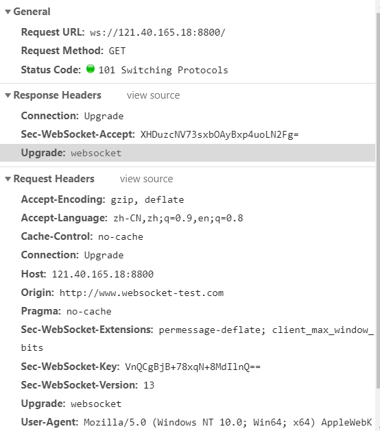
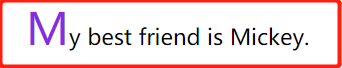
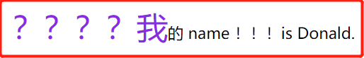

# 2020-06-19 题目来源：http://www.h-camel.com/index.html #

# [html] websocket握手成功会返回一个干什么状态吗？是200吗？ #
	
>WebSocket protocol 是HTML5一种新的协议。它实现了浏览器与服务器全双工通信(full-duplex)。在握手阶段借用http协议传输，建立连接后采用TCP协议传输。

>101状态码：切换协议 请求者已要求服务器切换协议，服务器已确认并准备切换

>从下图可以看出，握手阶段websocket利用http进行传输，握手成功后，返回状态码101 告知浏览器，服务器已确认并准备切换协议

	利用网页的开发者工具，可以看到websocket握手阶段的功能码是 101

	
	参考文章：
	https://lucumr.pocoo.org/2012/9/24/websockets-101/

	https://blog.csdn.net/weixin_42364319/article/details/104274029

# [css] ::first-letter有什么应用场景？ #
	first-letter选择器用来指定元素的第一个字母的样式

	p:first-letter { font-size: 200%; color: #8A2BE2; }

	
My best friend is Mickey.

>需要注意:display的属性值与first-letter生效是有关系的。 
>
>效果看这里 https://www.zhangxinxu.com/study/201609/first-letter-with-display-value.html
>
>display:inline|table|inline-table|table-row|flex; 的情况下，::first-letter伪元素不会生效

	应用场景：
	1. OL定义的列表类型有限制，比如不能定义汉字的“一、二、三”，我们只好手动来输入这些字符。这时候就可以使用first-letter伪类。
	2. display的属性会影响到first-letter伪类的效果。
	3. 辅助类 字符单独出现时，first-letter不会生效 例如 
????
  // 内容不会发生变化。
	4. 辅助类 字符 ＋ 内容，first-letter会对所有内容生效 例如
????辅助字符
 //内容全部发生变化。
	5. 以辅助类字符开头的，辅助类字符相当于赠品，会随着内容的首字母变化。

> `
？？？？我的 name ！！！is Donald.
`

# [js] 实现多张图片合成一张的效果 #
	1. js和canvas的合成方式 https://www.jb51.net/article/173366.htm
	function drawAndShareImage(){
	  var canvas = document.createElement("canvas");
	  canvas.width = 700;
	  canvas.height = 700;
	  var context = canvas.getContext("2d");
	  context.rect(0 , 0 , canvas.width , canvas.height);
	  context.fillStyle = "#fff";
	  context.fill();
	  var myImage = new Image();
	  myImage.src = "./2.png";  //背景图片 你自己本地的图片或者在线图片
	  myImage.crossOrigin = 'Anonymous';
	  myImage.onload = function(){
	    context.drawImage(myImage , 0 , 0 , 700 , 700);
	    context.font = "60px Courier New";
	    context.fillText("我是文字",350,450);
	    var myImage2 = new Image();
	    myImage2.src = "./1.png";  //你自己本地的图片或者在线图片
	    myImage2.crossOrigin = 'Anonymous';
	    myImage2.onload = function(){
	      context.drawImage(myImage2 , 175 , 175 , 225 , 225);
	      var base64 = canvas.toDataURL("image/png"); //"image/png" 这里注意一下
	      var img = document.getElementById('avatar');
	      // document.getElementById('avatar').src = base64;
	      img.setAttribute('src' , base64);
	    }
	  }
	}
	
	2. 动态生成的二维码和页面背景图合并 https://blog.csdn.net/m0_37585097/article/details/92594422
	$(function(){
        qcodeGenert($("#url").val());        
        var database=$('#qrcode canvas')[0];
        var dataURL = database.toDataURL();
        drawAndShareImage(dataURL);
	})

	function drawAndShareImage(imgBase64) {
	    var wid1 = 750 * 0.29;//大 右
	    var hei1 = 1334 * 0.37;//大 下
	    var canvas = document.createElement("canvas");
	    var context = canvas.getContext("2d"); 
	    var ratio = getPixelRatio(context);  // 关键代码
	    canvas.width = 750*ratio;
	    canvas.height = 1334*ratio;  
	    context.rect(0, 0, canvas.width*ratio, canvas.height*ratio);
	    context.fillStyle = "#fff";
	    context.fill(); 
	    //底图
	     var myImage = new Image();
	     myImage.src = src="${pageContext.request.contextPath}/mobileres/${actType}/images/share/share-back11.jpg";    
	     //背景图片  你自己本地的图片或者在线图片
	     myImage.crossOrigin = 'Anonymous';
	     myImage.onload = function () {
	        context.drawImage(myImage, 0, 0, 750*ratio, 1334*ratio);
	        //如果是已经生成的Img标签可以直接使用，如果是自定义的则用下面的方法手动设置src
	        var myImage2 = new Image();
	        myImage2.src = imgBase64;
	        myImage2.onload = function () {
	            context.drawImage(myImage2, wid1*ratio, hei1*ratio, 325*ratio, 345*ratio);
	           var base64 = canvas.toDataURL();  //"image/png" 这里注意一下,参数里面不要带"image/png" 之前网上代码还有这个参数一直报错
	            var img = document.getElementById('avatar');
	            img.setAttribute('src', base64);
	        }
	    }
	}
	二维码生成代码:
	function qcodeGenert(msg){
	
	    $("#qrcode").empty();
	
	    $("#qrcode").qrcode({
	        width: 225,
	        height:225,
	        text: msg                  //url
	    });
	}
	/* 像素密度*/   如果没这段代码生成的图片可能会模糊,这一块也耽误了很久
	function getPixelRatio(context) {
	    var backingStore = context.backingStorePixelRatio ||
	        context.webkitBackingStorePixelRatio ||
	        context.mozBackingStorePixelRatio ||
	        context.msBackingStorePixelRatio ||
	        context.oBackingStorePixelRatio ||
	        context.backingStorePixelRatio || 1;
	    return (window.devicePixelRatio || 1) / backingStore;
	};

# [软技能] 当你拿到设计稿后，你首页要做的是什么呢？ #

	1. 样式初始化，例如 去掉a标签的下划线，ul ol的list-style，margin， padding 等等； 参考淘宝初始化的设置。
	2. 屏幕尺寸 页面布局 移动端自适应；
	3. 导航栏设计 是应用bootstrap的navigation 还是 ul > li + a 来实现；
	4. 一定要注意，button 的hover active focus 的样式是否冲突；
	5. a标签的css引用顺序，顺序不当会造成样式不生效 L-V-H-A  a:link  a:visited  a:hover  a:active

	前端接到设计稿，咋下手？	https://blog.csdn.net/weixin_43315739/article/details/86134530