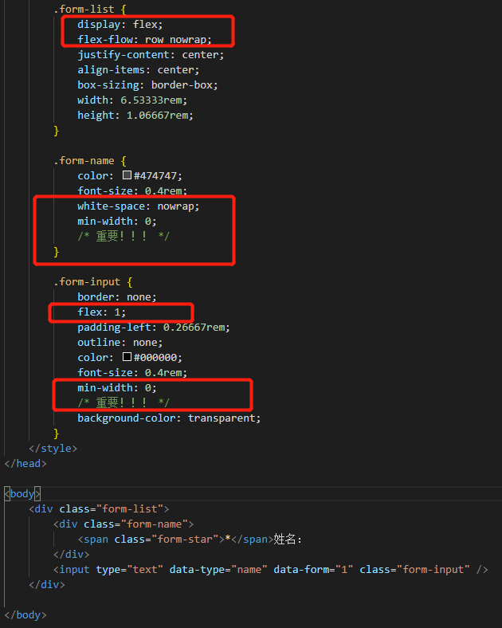
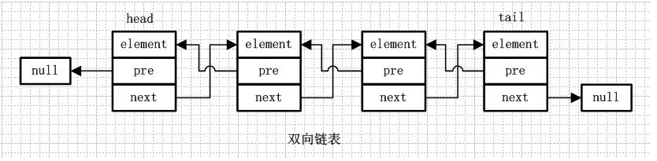

# 2020-06-20 题目来源：http://www.h-camel.com/index.html #

# [html] websocket可以携带cookie吗？为什么？如果可以，怎样做到呢？ #
	websocket可以携带cookie，因为websocket在握手的时候是http请求，浏览器可以携带客户端的cookie向服务器传输。
	可以在进行websocket连接建立前，也就是在握手阶段，利用cookie进行身份校验。

# [css] 举例说说你对white-space属性的理解 #
	white-space 属性指定元素内的空白怎样处理。
	white-space: nowrap; 可以实现元素内文本不换行，直到遇到 br 标签。
	
	1. 场景1： 实现文本单行显示，超出宽度部分显示为 ...
		white-space: nowrap; 
		overflow: hidden;
		width: 55%; 
    	text-overflow: ellipsis;

	2. 场景2： display: flex;遇到nowrap
		此种情况下，flex布局就会被打乱，比如内部元素超出父级范围或者其他情况。
		解决方式： 给flex布局级（例：设置“flex：1；”的子盒子）设置最小宽度为0；

# [js] 请使用 js 实现一个双向链表 #
	双向链表的结构图：每个结点包含三部分，指向前一个结点的指针（pre），指向后一个节点的指针（next），以及自己的数据部分（element）。

	具体的js实现，这篇文章说的很详细，https://blog.csdn.net/qq_34803821/article/details/85210941

# [软技能] 什么是物理像素和逻辑像素？ #
>物理像素dp（physical pixel）:指的是设备屏幕实际拥有的像素点，比如iphone6屏幕宽度方向有750个像素点，高度方向1334个像素点。所以iphone6物理像素为 750*1334。 单位是px。

>逻辑像素/设备独立像素dip（Device Independent Pixels）：按照内容的尺寸计算的单位(pt)，比如iPhone 4的逻辑像素是480x320pt。但是由于每个逻辑的点因为视网膜屏密度增加了一倍，即1pt=2px，那么其实iPhone 4的物理像素是960x640px。 

>设备像素比dpr（Device Pixel Ratio）:一个设备的物理像素与逻辑像素之比。设备像素比 (dpr)＝ 物理像素(dp) / 设备独立像素(dip)。

>屏幕像素密度ppi（pixel per inch）：屏幕像素密度(ppi)是指一个设备表面上存在的像素数量，它通常以每英寸有多少像素来计算。屏幕像素密度与屏幕尺寸和屏幕分辨率有关，在单一变化条件下，屏幕尺寸越小、分辨率越高，像素密度越大，反之越小。

>每英寸的像素dpi （Dots Per Inch）：是一个量度单位，用于点阵数码影像，指每一英寸长度中，取样、可显示或输出点的数目。DPI是打印机、鼠标等设备分辨率的度量单位。