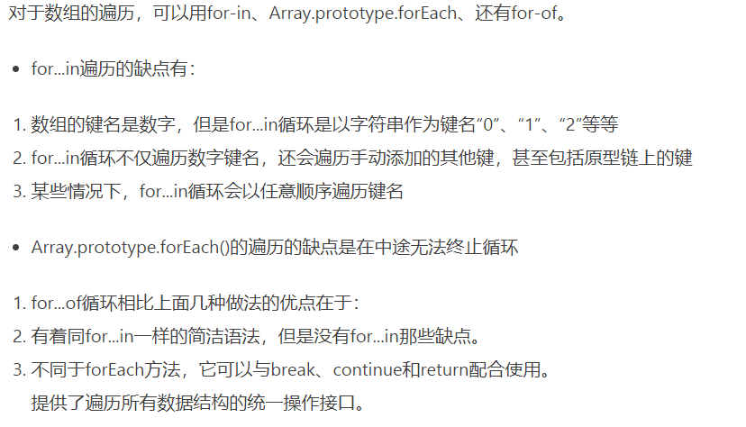

# 2020-06-24 题目来源：http://www.h-camel.com/index.html #

# [html] 精确获取页面元素位置的方式有哪些？ #
	1. var px = document.getElementById("im").getBoundingClientRect().top;
	2. 累加元素offsetParent的offsetLeft和offsetTop一直到DOM的顶层。
		//取得元素x坐标  
	    function pageX(elem) {  
	       return elem.offsetParent?(elem.offsetLeft+pageX(elem.offsetParent)):elem.offsetLeft;  
		}  
		//取得元素y坐标  
		function pageY(elem) {  
		   return elem.offsetParent?(elem.offsetTop+pageY(elem.offsetParent)):elem.offsetTop;  
		}
	标准模式和怪异模式的测试： https://blog.csdn.net/ulark/article/details/5047684

# [css] 什么是关键帧动画？ #
	@keyframes语法：@keyframes<animation-name>: {<keyframes-selector>{<CSS-styles>}}

# [js] for in 和 for of 的区别？ #
	想要知道obj的长度，当然不能obj.length；获取对象和属性可以使用for-in

	根据 ECMA-262（ECMAScript）第三版中描述，for-in 语句的属性遍历的顺序是由对象定义时属性的书写顺序决定的。

	根据 ECMA-262（ECMAScript）第五版规范中，对 for-in 语句的遍历机制又做了调整，属性遍历的顺序是没有被规定的。

	但是，ES6中提出了 for of，作为遍历所有数据结构的统一方法，可但是，数据结构需要部署iterator迭代器接口才可以使用for of，
	普通对象for of 会报错，for in可以遍历键名
	for of循环可以使用的范围包括数组、Set 和 Map 结构、某些类似数组的对象（比如arguments对象、DOM NodeList 对象）、后文的 Generator 对象，以及字符串
	

# [软技能] 上线后什么情况下会回滚呢？回滚的流程是怎样的？ #
	上线后功能出现bug，就需要进行回滚操作

	1.上线流程

	将测试完成的代码提交到git版本库的master分支
	将当前服务器的代码全部打包并记录版本号，备份
	将master分支的代码提交到线上服务器，生成新版本号
	
	2.回滚流程
	
	将当前服务器的代码打包并记录版本号，备份
	将备份的上一个版本号解压，覆盖到线上服务器，并生成新的版本号
