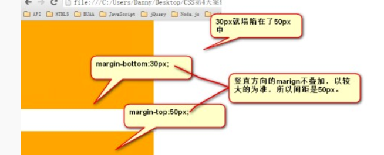

# 2020-06-28 题目来源：http://www.h-camel.com/index.html #

# [html] 实现一个页面锁屏的功能 #
	锁屏的最终效果就是退出登录，思路是 点击锁屏按钮等操作时 使token cookie过期或失效， 跳转到锁屏页面或者登陆页面。

	百度经验里面的 利用vue实现web页面的锁屏效果 https://jingyan.baidu.com/article/ff42efa94db46c819f220243.html	

	html页面的锁屏简单实现 https://www.cnblogs.com/lizhaoyao/p/13084914.html

	如何给某个页面加上一个锁屏功能呢，表现形式有这么几种
	
	1.长时间未操作页面自动跳到一个锁屏提示页面需要再次输入密码才能进入。实现方案可以是定时器监控到页面有没有被操作了，长时间未动，自己跳转一下。
	
	2.点击某个按钮（立即锁屏）这种主动触发，这个就比较简单了，a标签页面跳转即可。
	
	3.用户按下键盘进行触发锁屏，比如 Ctrl+l
	
	我认为这种方式可以简单实现，但是并不适用，还是处理cookie和token的方式比较好。

# [css] 举例说明BFC会与float元素相互覆盖吗？为什么？ #
	BFC block formatting context 块级格式上下文。此环境中按照一定规则进行布局不会影响到盒外元素。
	浮动元素就会形成BFC，浮动元素的内部子元素主要受到浮动元素的影响，而不会受到其他浮动元素的影响。
	在CSS3中，BFC叫做 flow root，可见一斑。

>形成BFC的条件
>
>1.浮动元素： float除了 none 以外的值；
>
>2.绝对定位：position： absolut|fixed；
>
>3.display： inline-blocks|table-cells|table-captions;
>
>4.overflow: hidden|auto|scroll;

>BFC的作用：
>
>1.包含浮动元素： 高度塌陷问题：在通常情况下父元素的高度会被子元素撑开，而在这里因为其子元素为浮动元素所以父元素发生了高度坍塌，上下边界重合。这时就可以用bfc来清除浮动了。 也就是overflow 为什么能够清除浮动的另一个说明。
>
>2.不被浮动元素覆盖： 浮动兄弟遮盖问题，由于左侧块级元素发生了浮动，所以和右侧未发生浮动的块级元素不在同一层内，所以会发生遮挡问题。 利用overflow： hidden； 来触发BFC
>
>3.BFC会阻止外边距的折叠： margin塌陷问题：在标准文档流中，块级标签之间竖直方向的margin会以大的为准，这就是margin的塌陷现象。可以用overflow：hidden产生bfc来解决。

# [js] 举例说明js立即执行函数的写法有哪些？ #
	正常函数 function funName() {}; 
	但是 IIFE 函数 是没有函数名的，这样，js在解析时会把它作为函数声明处理，所以需要将函数声明转换成函数表达式，
	消除了javascript引擎识别函数表达式和函数声明的歧义，告诉javascript引擎这是一个函数表达式，不是函数声明，
	可以在后面加括号等符号，并立即执行函数的代码。

	(function(a){
   		console.log(a);   //firebug输出123,使用（）运算符
	})(123);
	 
	(function(a){
	    console.log(a);   //firebug输出1234，使用（）运算符
	}(1234));
	 
	!function(a){
	    console.log(a);   //firebug输出12345,使用！运算符
	}(12345);
	 
	+function(a){
	    console.log(a);   //firebug输出123456,使用+运算符
	}(123456);
	 
	-function(a){
	    console.log(a);   //firebug输出1234567,使用-运算符
	}(1234567);
	 
	var fn=function(a){
	    console.log(a);   //firebug输出12345678，使用=运算符
	}(12345678)
	
	加括号是最安全的做法，因为！、+、-等运算符还会和函数的返回值进行运算，有时造成不必要的麻烦。

>iife的作用在哪里呢？
>
>js没有私有作用域的概念，如果在多人开发的项目上，你在全局或局部作用域中声明了一些变量，可能会被其他人不小心用同名的变量给覆盖掉，根据javascript函数作用域链的特性，可以使用这种技术可以模仿一个私有作用域，用匿名函数作为一个“容器”，“容器”内部可以访问外部的变量，而外部环境不能访问“容器”内部的变量，所以( function(){…} )()内部定义的变量不会和外部的变量发生冲突，俗称“匿名包裹器”或“命名空间”。
>
>JQuery使用的就是这种方法，将JQuery代码包裹在( function (window,undefined){…jquery代码…} (window)中，在全局作用域中调用JQuery代码时，可以达到保护JQuery内部变量的作用。

	来自： https://www.cnblogs.com/chris-oil/p/4862083.html

# [软技能] 你对颜色的搭配有了解吗？你觉得红、绿、蓝分别搭配什么颜色比较好看呢？ #
	在线颜色搭配工具 http://www.wenliku.com/color/