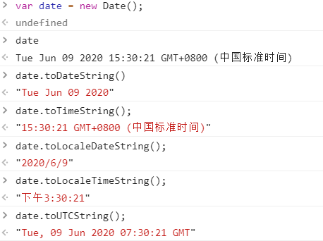

# JavaScript中的常见陷阱 #
* sort()的排序竟然出现错误？
* new Date()十分好用？
* 替换函数没有真的替换？
* 谨慎对待比较运算
* 数组不是基础类型*
* 闭包*
* Math.min()比Math.max()大？ *

----------

## 1.sort()的排序竟然出现错误？ ##
	JavaScript默认使用字典序(alphanumeric)来排序。因此，[1, 2, 5 , 10, 4, 11].sort()的结果是[1, 10, 11, 2, 4, 5]。
	如果你想正确的排序，应该这样做：[1, 2, 5 , 10, 4, 11].sort((a, b) => a - b)	 

## 2.new Date()十分好用？ ##
	new Date()的使用方法有：
	--不接收任何参数：返回当前时间； new Date();// Tue Jun 09 2020 15:18:41 GMT+0800 (中国标准时间)
	--接收一个参数x: 返回1970年1月1日 + x毫秒的值。 new Date(1);// Thu Jan 01 1970 08:00:00 GMT+0800 (中国标准时间)
	--new Date(1, 1, 1)返回1901年2月1号。仅限 new Date(99,1,1);// Mon Feb 01 1999 00:00:00 GMT+0800 (中国标准时间)
	--new Date(2020, 1, 1)不会在1900年的基础上加2020，而只是表示2020年。

	--获取当前时刻的时间戳 +new Date();// 1591687731790
	--格式化日期的一些方法：其中UTC为现世界标准，无时区概念。

## 3.替换函数没有真的替换？ ##
	let s = "bob";
	const replaced = s.replace('b', 'l');
	replaced === "lob" // 只会替换掉第一个b
	s === "bob" // 并且s的值不会变
	
	如果想要全部替换，要使用正则表达式： "bob".replace(/b/g,'l'); // lol, g为全局模式

	这里想到一个清除字符串首尾空格的函数：
	String.prototype.trim = function () {
		return this.replace(/^\s+/, '').replace(/\s+$/, '');
	}
	var str = " nothing "; str.trim();// "nothing"

## 4.谨慎对待比较运算 ##
	关于比较运算符，我们都知道，“==” “===” 都会进行隐式的数据类型转换，但是：
	// 这些可以
	'abc' === 'abc' // true
	1 === 1 // true
	// 然而这些不行
	[1,2,3] == [1,2,3] // false
	[1,2,3] === [1,2,3] // false 即使是相同的数据类型，但他们是不同的数组，只是元素相同而已，
	{a: 1} === {a: 1} // false
	{} === {} // false

	"str" == "str" //true
	"str" === "str" // true

	这些让我不禁联想，难道是引用类型的数据出现的问题吗？。。。js的基本数据类型存放在堆，而引用类型的数据是存放在栈里。

## 5.数组不是基础类型 ##
	这个没什么好说的了，typeof [] === "object"; // true
	基本的数据类型： undefined null boolean number string symbol
	引用数据类型： object function
	array和date： 返回的都是object类型
	null 返回的数据类型也是object类型

	那么，检测数据类型的函数怎么写呢？ 
	var arr = new Array(); 
	这样：
	Object.prototype.toString.call(arr) === "[object Array]";
	或者，这样：
	arr.constructor == Array;// true
	arr.constructor == "Array"; // false "Array"就变成字符串了，怎么可以
	还可以这样:
	arr typeof == "object"; //这样当然不行了，仅限部分的基本数据类型，否则知道object，再具体就不知道了 

## 6.闭包 ##
	const Greeters = []
	for (var i = 0 ; i < 10 ; i++) {
		Greeters.push(function () { return console.log(i) })
	}
	Greeters[0]() // 10
	Greeters[1]() // 10
	Greeters[2]() // 10

	怎么debug就不管了，什么原因造成的呢？，简单描述一下
	首先javascript是单线程的，在线程空闲前，事件处理器是不会进入执行栈的，等待主线程中的同步任务执行过后，才能执行被挂起的异步任务。
	结合代码： 等到同步任务执行完，i的值为10，然后执行push操作，也就是Greeters里面的10个元素都是10

	想要实现数组索引值和元素值相同，建议异步编程实现，比如说 回调函数，事件监听，发布/订阅模式，promise， async/wait等等

## 7.Math.min()比Math.max()大？ ##
	Math.min() < Math.max() // false
	因为Math.min() 返回 Infinity, 而 Math.max()返回 -Infinity。