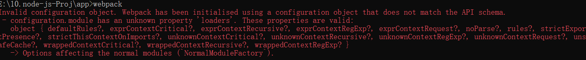

# WebPack的安装使用(亲测) #
	Webpack 可以将多种静态资源 js、css、less 转换成一个静态文件，减少页面的请求。
----------

## 1.安装WebPack ##
	- 本地环境要求node.js
	- 建议使用cnmp进行安装，
	  cnmp install webpack -g （菜鸟教程上推荐安装方式）
	  使用淘宝镜像安装：npm install -g cnpm --registry=https://registry.npm.taobao.org
	  如果安装过程报错：npm resource busy or locked...可以先删除之前安装的node_modules
	  npm cache clean
	  npm install
	
	经过摸爬滚打，我总结了一下自己的安装过程：
	1. 安装webpack： npm install --save-dev webpack -g (建议全局安装)，安装后会有版本提示信息 
	

	2. 安装webpack-cli：npm install --save-dev webpack-cli -g (建议全局安装)
	

	3. 测试安装是否成功：webpack -v 

----------
## 2.创建项目 ##
	新建一个目录，mkdir app

### *创建1个js ###
	在 app 目录下添加 runoob1.js 文件，代码：document.write("the ocean");
	在 app 目录下添加 index.html 文件，代码如下:

	

	使用命令来进行打包：
	webpack runoob1.js bundle.js会产生错误：

	所以应该使用命令：webpack runoob1.js --output-filename bundle.js --output-path . --mode development

	浏览器打开index.html

----------

### *创建2个js ###
	在 app 目录下再添加 runoob2.js 文件，代码：module.exports = "It works from runoob2.js.";
	更新runoob1.js中的代码： document.write(require("./runoob2.js"));
	使用命令：webpack runoob1.js --output-filename bundle.js --output-path . --mode development

----------

	浏览器打开index.html

	总结：
	webpack 根据模块的依赖关系进行静态分析，这些文件(模块)会被包含到 bundle.js 文件中。Webpack 会给每个模块分配一个唯一id并通过这个id索引和访问模块。 
	在页面启动时，会先执行 runoob1.js 中的代码，其它模块会在运行 require 的时候再执行。

----------
## 3.loader ##
	如果要处理其他类型文件需要使用loader进行转换。
	添加css文件：
	css-loader--遍历css文件，找到url表达式然后处理；
	style-loaser--将原来的css代码插入页面中的一个style标签中；
	安装： npm install css-loader -g; npm install style-loader -g; 
	可能会发生如下错误：

	
	如何处理？？？？使用如下命令安装：
	npm install style-loader --save-dev -g
	npm install css-loader --save-dev -g
		
----------
	在app目录下新建style.css文件, 代码：body{ background: skyblue; }
	更新runoob1.js中的代码： 
	require("!style-loader!css-loader!./style.css");
	document.write(require("./runoob2.js"));

	使用命令：webpack runoob1.js --output-filename bundle.js --output-path . --mode development
	发生错误：
	ERROR in ./runoob1.js
	Module not found: Error: Can't resolve 'css-loader' in 'E:\10.node-js-Proj\app'@ ./runoob1.js 1:0-47

	
	浏览器打开index.html

----------
## 4.配置文件 ##
	可以将一些编译选项放在配置文件中，便于管理：
	app目录下信息新建webpack.config.js 文件，代码如下所示(webpack3.0的写法，如果版本不匹配的话会报错)：
	module.exports = {
	    entry: "./runoob1.js",
	    output: {
	        path: __dirname,
	        filename: "bundle.js"
	    },
	    module: {
	        loaders: [
	            { test: /\.css$/, loader: "style-loader!css-loader" }
	        ]
	    }
	};
	执行webpack命令即可，可能会报错：

	原因:这个配置文件的版本和我们当前安装的webpack的版本不匹配。接下来这段我们只需要看前面一句，意思是webpack.config.js这个配置文件里的module属性有一个未知的配置项loaders，原因就是我们当前安装的webpack版本已经去掉了这个配置。webpack的版本并没有向后兼容。
	
	webpack.config.js匹配写法：

	const path = require("path")
	module.exports = {
	    // 入口文件可以有多个，多个的时候用数组的形式写
	    entry: {
	        main: "./runoob1.js",
	    },
	 
	    // 打包环境：开发development/生产production
	    mode: "development",
	 
	    // 出口，只能有一个
	    output: {
	        filename: "bundle.js", //[name]-bundle.js
	        path: path.resolve(__dirname, "") //生成文件在app目录下,也可以../dist
	    }
	}

----------
## 5.开发环境 ##
	当项目逐渐变大，webpack 的编译时间会变长，可以通过参数让编译的输出内容带有进度和颜色。代码：webpack --progress --colors
	监听模式：webpack --progress --colors --watch
	通过一个 socket.io 服务实时监听它们的变化并自动刷新页面：
	# 安装
	cnpm install webpack-dev-server -g
 
	# 运行
	webpack-dev-server --progress --colors