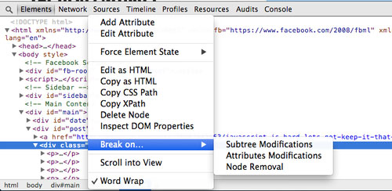
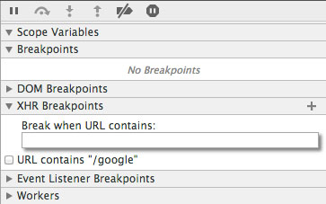
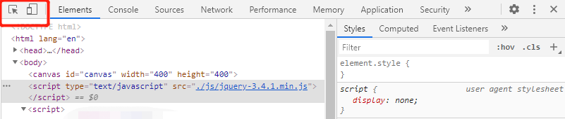
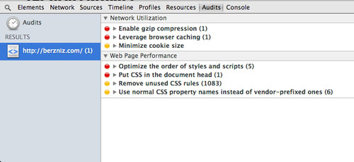

> http://berzniz.com/post/78260747646/5-javascript-debugging-tips-youll-start-using-today

1. 使用debugger, 在代码中添加一个断点效果；如果是有条件的断点，可以和if一起使用；

2. 设置在DOM node发生变化时触发断点
	
	有时候DOM可能发生一些奇怪的变化，很难找出问题在哪chrome的开发工具里有一个功能，break on， 在dom节点右键就可以看到，触发条件可以选择 节点被删除  节点属性变化	子节点发生变化

3. ajax断点
	XHR断点，或者ajax断点，在发生特定的ajax调用时来触发他们。 调试网络时很有用

4. 移动设备模拟环境
	chrome的调试窗口有一个移动设备模拟，有各种尺寸的移动终端。

5. 使用Audits来改进网站
	YSlow是一个非常棒的工具。谷歌浏览器的开发者工具里也有一个非常类似的工具，叫Audits。
	它可快速的审计你的网站，给你提出非常实际有效的优化你的网站的建议和方法。
